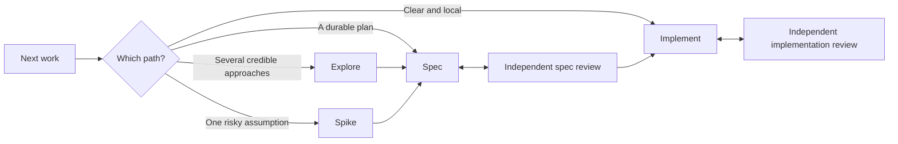

# Agent Workflow V2

Agent Workflow V2 is a portable coding workflow for Codex, Claude Code, Cursor,
and OpenCode. It keeps the core planning, implementation, and independent-review
loop strict while letting small work stay small.

Use it as an always-on daily workflow or invoke individual phases only when you
need them.

https://github.com/user-attachments/assets/17d30f20-1bba-4534-b3e8-072a9b27b7de

## How it works

Exploration and spikes are optional. Formal specifications and implementation
include fresh inner review; outer review is configurable and selected according
to risk or direct user request. Clear, local changes can take the Fast route
without unnecessary planning ceremony.

## Using the workflow

Ask for work naturally or invoke a phase directly:

- **Project lead** keeps a project grounded, plans upcoming work, and hands
  implementation to fresh tasks.
- **Explore** compares credible approaches when the direction is genuinely open.
- **Spike** proves or rejects one risky assumption before committing to a design.
- **Spec** defines one reviewable implementation boundary.
- **Implement** builds, verifies, and drives the selected work through review.
- **Review PR** thoroughly reviews someone else's change and calibrates what is
  actually blocking.

The workflow is designed to preserve momentum. Agents continue through ordinary
implementation and review loops, stopping only for decisions or actions that
genuinely require user authority.

## Plans and project context

Project facts stay in the project rather than the portable workflow.

For durable plans, the default is a private `.agent-workflow/plans/` directory
inside each repository, excluded through `.git/info/exclude`. You may instead
choose a tracked or custom location, or keep compact work entirely in
conversation. A nested planning repository is optional, not required.

A small repository adapter can record project-specific facts, verification
routes, plan storage, and stricter local boundaries without copying the central
workflow rules.

## Try it

1. Clone this repository to a stable user-level location.
2. Give an existing agent the path to
   [`workflow/skills/setup-workflow/SKILL.md`](workflow/skills/setup-workflow/SKILL.md)
   and ask it to run the read-only setup audit.
3. Choose **on-demand** to try V2 without a persistent kernel, or **always-on**
   to use it as your daily workflow.
4. Select your hosts, model profiles, plan storage, and outer-review behavior.
5. Review the proposed configuration changes before setup applies them.
6. Open fresh sessions and begin working naturally.

The setup agent verifies host support and keeps one canonical installation rather
than maintaining copied skills for each application.

For package structure and behavior, see the
[package overview](workflow/README.md). For installation, host configuration,
switching modes, and removal, see the
[setup and uninstall guide](workflow/docs/SETUP.md).
